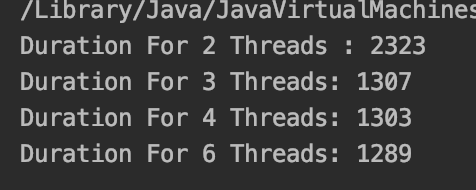
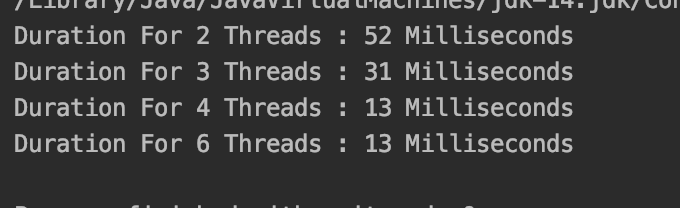

# Parallel Programming

This contains two tasks of Java programs executed in Parallel. 
The First task implemets a bubble sort algorithm executed in parallel
The Second Task consists of an inventory system which contains barcodes and 
its tools of various types, which is executed in parallel to select barcodes of 3 
items of type 1, 5 items of type 7 and 8 items of type 10.


# Installation
 1. Download and install Java Runtime Environment or Java Development Kit
 2. Clone this repo to your local machine using:
  ```bash
 git clone https://github.com/Tamer7/ParallelProgrammingAssignment.git
 ```
 3. Open the folders using Eclipse or IntelliJ IDEA
 
 
# Usage
 1. Open the folders installed in a new project (Eclipse or IntelliJ)
 2. Right click on the "Main" file and click run
 

# Results
 - Results of Task 1
 
 
 - Results of Task 2
 
 


# Built With

- Java

# Authors

- Tamer Algarmakany


        

 
 
 
 
 
        
